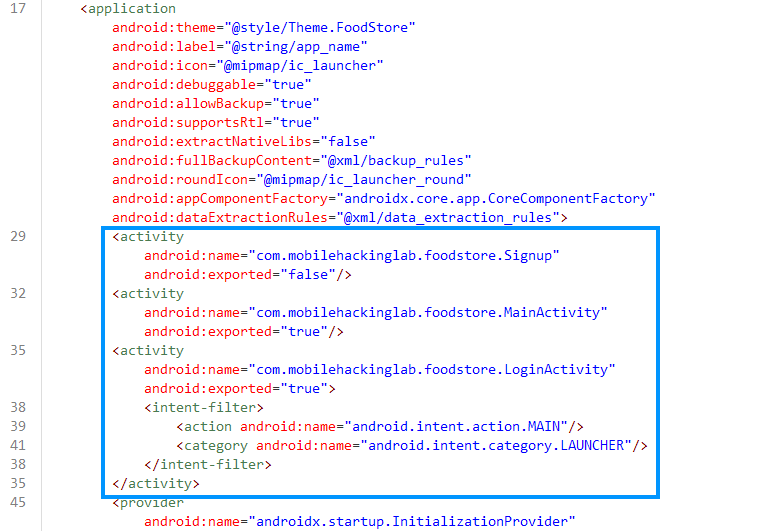
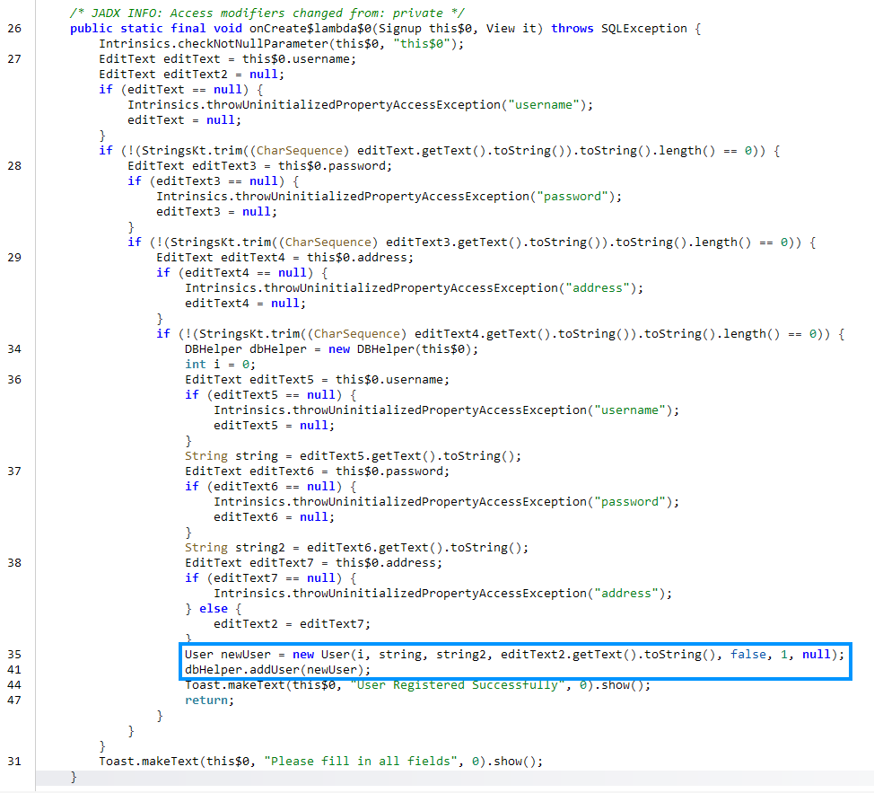
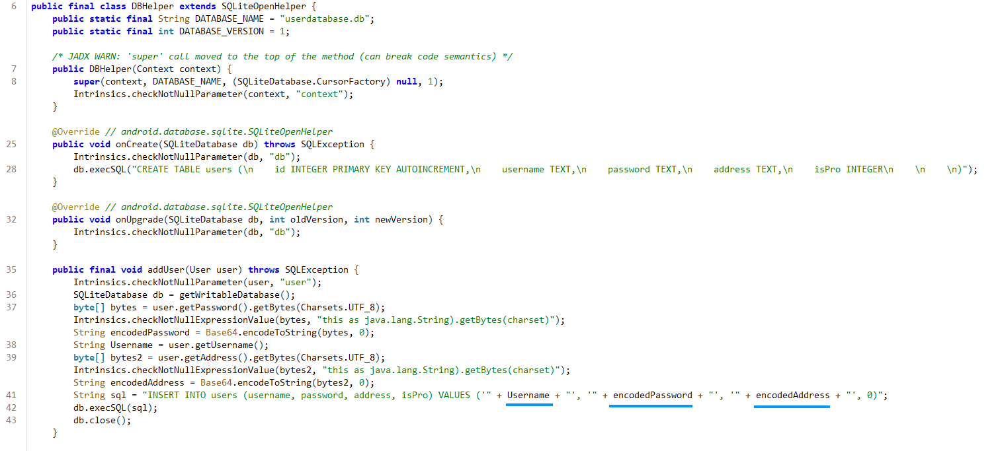
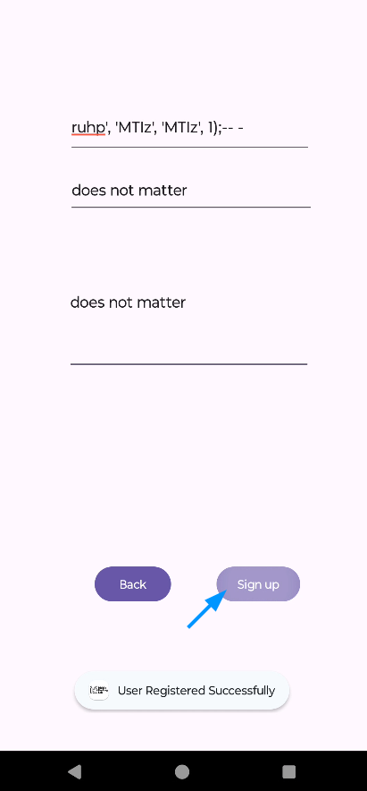
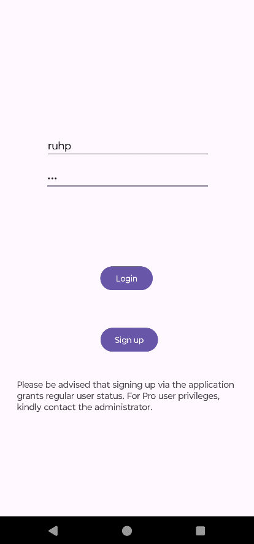
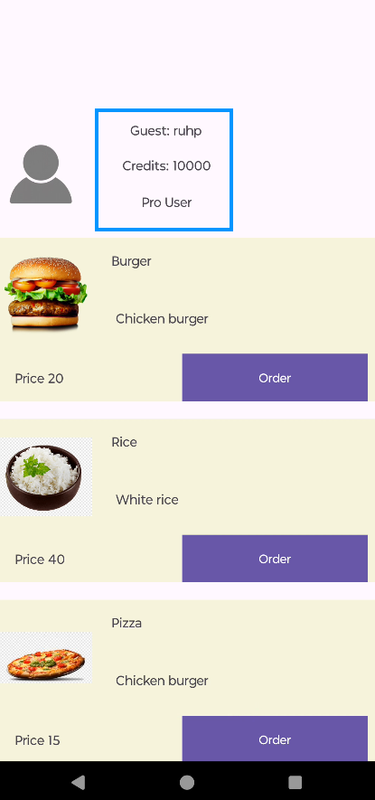
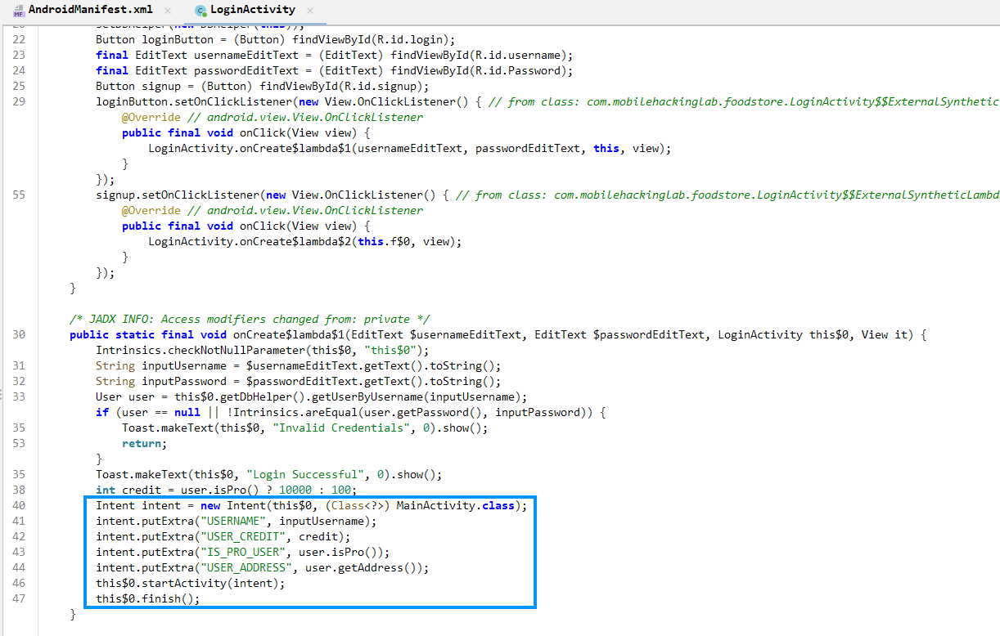
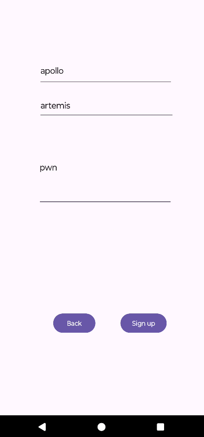
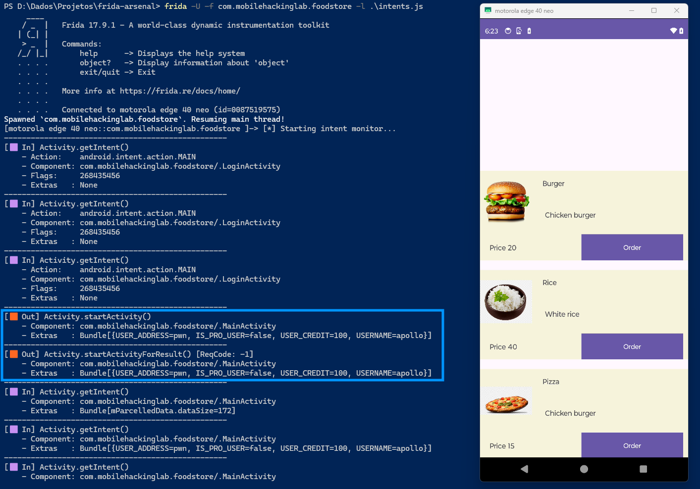
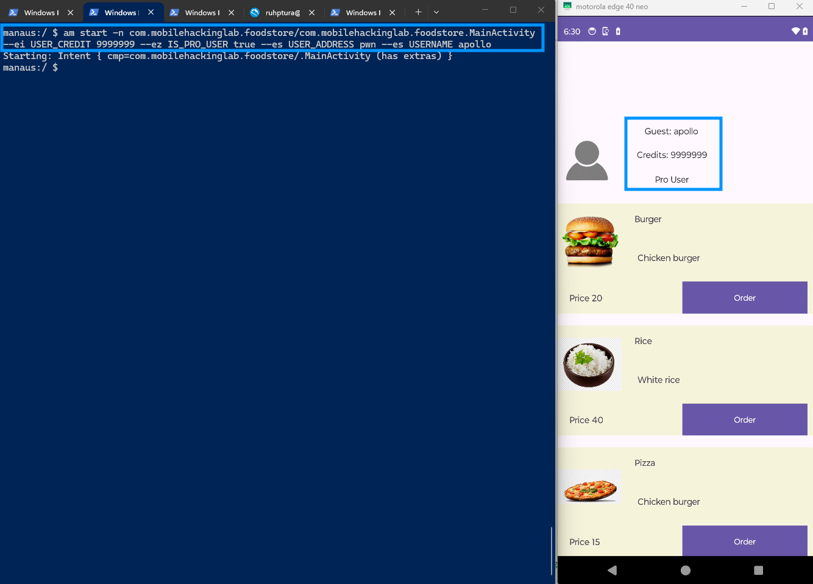

# Food Store

The app is a simple food delivery store. You can create an account, log in, and buy from the menu. It also has two different user roles: **normal** and **pro**. The goal is to log in as a pro user.

Looking at the decompiled code, we can see 3 activities.



### Exploiting SQLite Injection

The Signup activity has a method to register a new user into a database. It basically checks if any of the inputs (username, password, address) are null, creates an instance of the *User* class, and passes it to a method of the DBHelper class.



Notice that the Signup method throws an SQLException, indicating that it uses SQL to store the user data.

Checking the addUser method in DBHelper, we can spot the vulnerability: SQLite injection.



We have user inputs being concatenated directly into a SQL query, which is of course an issue. I will inject into the "Username" variable because it is not encoded, allowing us to pass characters like `'` directly.

Crafting the following payload (MTIz is 213 in base64):

```ruhp', 'MTIz', 'MTIz', 1);-- - ```

We should set our "isPro" to 1.



The password and address inputs don't matter because they will be commented out by the SQL injection anyway.





We successfully logged in as a Pro User, with 10,000 credits by default.

### Exploiting Exported MainActivity

Another interesting fact is that the login is performed by sending an intent to the MainActivity class, which is exported.



I will create a normal user for this new PoC.



Using Frida, we can monitor every intent flowing through the app and confirm what we discovered during static analysis (**intents.js**).



Finally, I will craft an intent to give *apollo* pro status and some extra credits.

```am start -n com.mobilehackinglab.foodstore/com.mobilehackinglab.foodstore.MainActivity --ei USER_CREDIT 9999999 --ez IS_PRO_USER true --es USER_ADDRESS pwn --es USERNAME apollo```



> P.S. The only LLM usage was a bit of help crafting the intents hooking script.