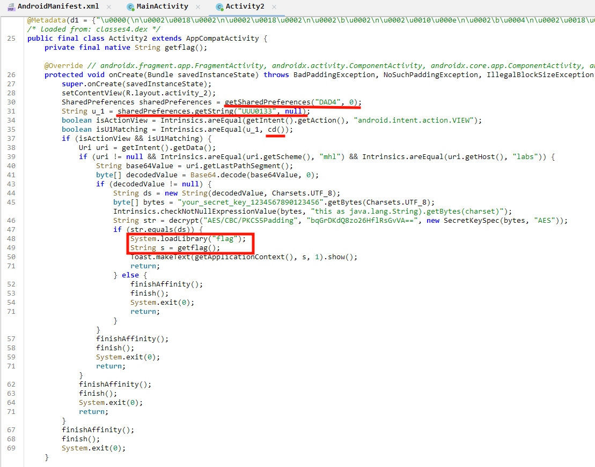
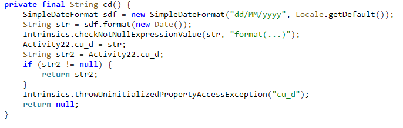
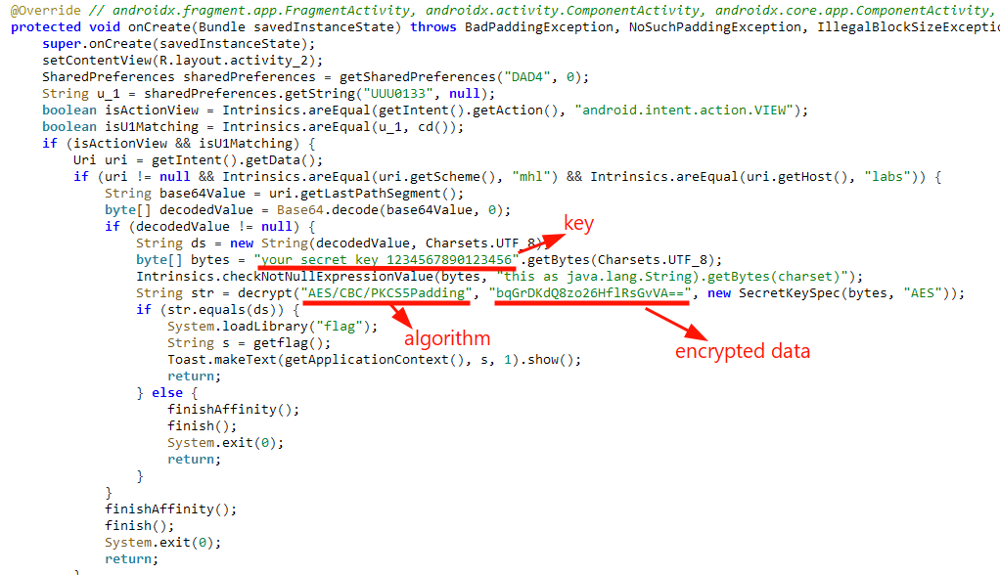
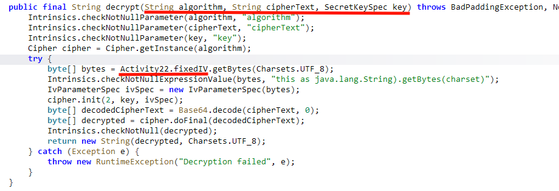
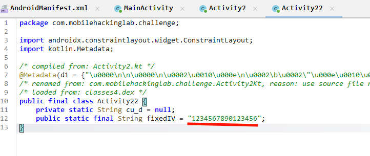
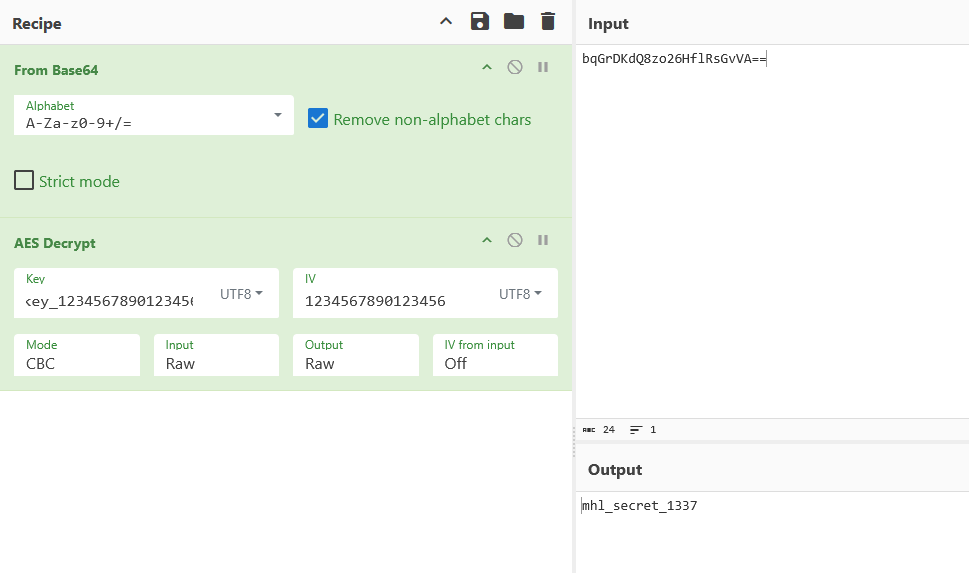
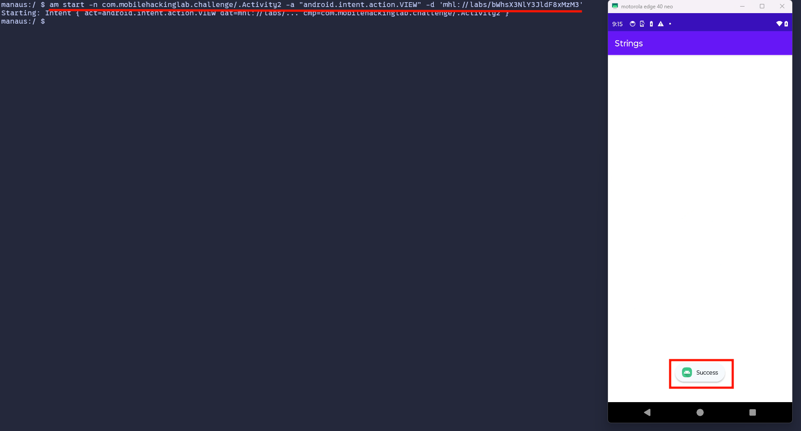
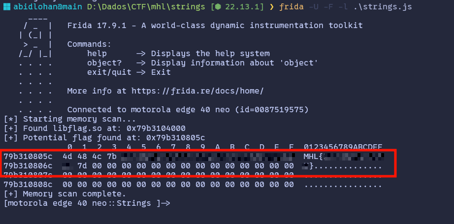

# Strings

The interesting exported activity is `Activity2`, which handles deeplinks via its `getIntent` logic.

Looking at the `onCreate` method, we see there are several conditions that must be met to load the `flag` library:



The first `if` block has two conditions:
1. The activity must be started with an `Intent` containing the action `android.intent.action.VIEW`.
2. The value of the string `UUU0133` in `DAD4.xml` must equal `cd()` (the current date in `dd/MM/yyyy` format).



Therefore, I manually created the shared preference file to meet this condition:

```bash
echo '<?xml version="1.0" encoding="utf-8" standalone="yes" ?><map><string name="UUU0133">23/06/2026</string></map>' > /data/data/com.mobilehackinglab.challenge/shared_prefs/DAD4.xml
```

The subsequent conditions check if the activity is called with the data URI `mhl://labs/<base64-secret>`. Note that this is a deep link call.

To discover this secret, we need to examine this section of the code:



The signature of the `decrypt` method clarifies what each parameter represents. The last piece required for decryption is the Initialization Vector (IV), which can be found in `Activity22`.





Finally, knowing we are dealing with AES in CBC mode and having the encrypted data, the key, and the IV, we can use CyberChef to decrypt the secret.



We can now start the activity using the following command:
```
am start -n com.mobilehackinglab.challenge/.Activity2 -a "android.intent.action.VIEW" -d 'mhl://labs/bWhsX3NlY3JldF8xMzM3'
```



However, the Toast does not display the flag itself, only a 'Success' message. Nevertheless, we can find the flag in memory (e.g., using a Frida script like `strings.js`).

Searching for the pattern 'MHL{' in memory inside `libflag.so`, we get:

